# Scheduling diagrams

Diagrams of how Flow Recipe plans a cooking session. They go from the whole system down to single decisions, and each
diagram shows one thing. The text that defines the rules is [SCHEDULING.spec.md](../SCHEDULING.spec.md). The code is
in `packages/scheduler`, and `packages/scheduler/README.md` is its contract.

| Level | What it shows |
|---|---|
| L0 Context | who uses the system and what goes in and out |
| L1 Containers | the apps, the server, the database and the scheduler package |
| L2 Scheduler | the scheduler's data pipeline, its modules and its output |
| L3 Graph | how recipes become one task graph (Phases A and B) |
| L3 Planner | how the task graph becomes a plan (Phases C to G) |
| L3 Resources | the states of tools, the oven and timers |
| L3 Online | what happens once cooking starts: events, replanning, interrupts |
| L4 Examples | real plans produced by the scheduler for the buns and negroni recipes |

---

## L0 Context

### D1. System context

The host chooses dishes and settings, everyone cooks from their own lane, and the server plans with the scheduler.

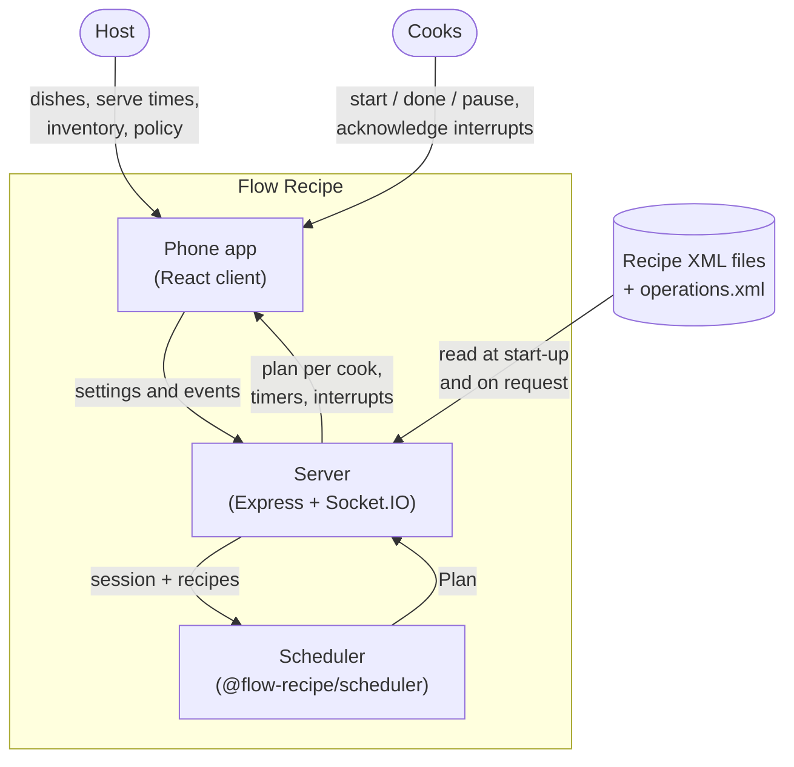
```mermaid
flowchart TB
  host(["Host"])
  cooks(["Cooks"])
  subgraph fr["Flow Recipe"]
    app["Phone app<br/>(React client)"]
    server["Server<br/>(Express + Socket.IO)"]
    sched["Scheduler<br/>(@flow-recipe/scheduler)"]
  end
  recipes[("Recipe XML files<br/>+ operations.xml")]
  host -- "dishes, serve times,<br/>inventory, policy" --> app
  cooks -- "start / done / pause,<br/>acknowledge interrupts" --> app
  app -- "settings and events" --> server
  server -- "plan per cook,<br/>timers, interrupts" --> app
  server -- "session + recipes" --> sched
  sched -- "Plan" --> server
  recipes -- "read at start-up<br/>and on request" --> server
```

---

## L1 Containers

### D2. Containers and data stores

The server is the planning authority: clients never plan, they render the plan they receive and send events.

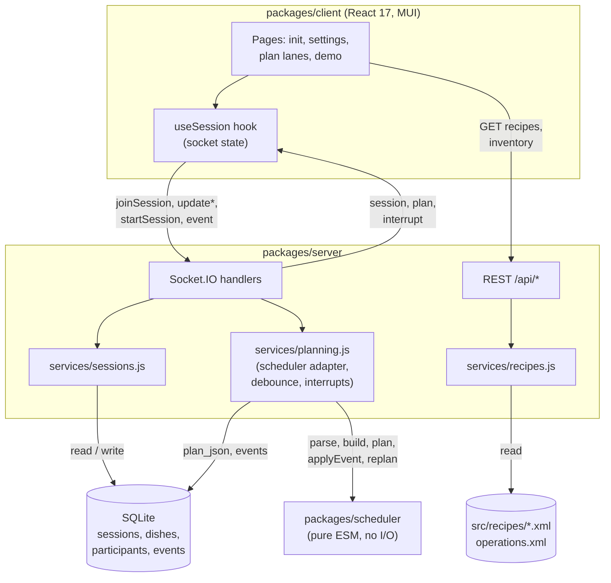
```mermaid
flowchart TB
  subgraph client["packages/client (React 17, MUI)"]
    pages["Pages: init, settings,<br/>plan lanes, demo"]
    hook["useSession hook<br/>(socket state)"]
  end
  subgraph server["packages/server"]
    rest["REST /api/*"]
    io["Socket.IO handlers"]
    sessions["services/sessions.js"]
    planning["services/planning.js<br/>(scheduler adapter,<br/>debounce, interrupts)"]
    recipesSvc["services/recipes.js"]
  end
  db[("SQLite<br/>sessions, dishes,<br/>participants, events")]
  xml[("src/recipes/*.xml<br/>operations.xml")]
  sched["packages/scheduler<br/>(pure ESM, no I/O)"]
  pages --> hook
  hook -- "joinSession, update*,<br/>startSession, event" --> io
  io -- "session, plan,<br/>interrupt" --> hook
  pages -- "GET recipes,<br/>inventory" --> rest
  rest --> recipesSvc
  io --> sessions
  io --> planning
  sessions -- "read / write" --> db
  planning -- "plan_json, events" --> db
  recipesSvc -- "read" --> xml
  planning -- "parse, build, plan,<br/>applyEvent, replan" --> sched
```

### D3. Three kinds of input

Recipes hold only facts. How an operation behaves lives in the catalogue. People, tools and preferences come from the
session.

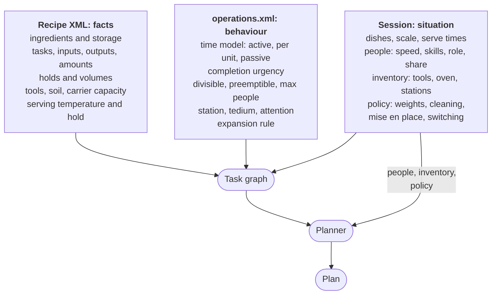
```mermaid
flowchart TB
  facts["<b>Recipe XML: facts</b><br/>ingredients and storage<br/>tasks, inputs, outputs, amounts<br/>holds and volumes<br/>tools, soil, carrier capacity<br/>serving temperature and hold"]
  behaviour["<b>operations.xml: behaviour</b><br/>time model: active, per unit, passive<br/>completion urgency<br/>divisible, preemptible, max people<br/>station, tedium, attention<br/>expansion rule"]
  session["<b>Session: situation</b><br/>dishes, scale, serve times<br/>people: speed, skills, role, share<br/>inventory: tools, oven, stations<br/>policy: weights, cleaning,<br/>mise en place, switching"]
  facts --> tg(["Task graph"])
  behaviour --> tg
  session --> tg
  tg --> planner(["Planner"])
  session -- "people, inventory,<br/>policy" --> planner
  planner --> plan(["Plan"])
```

---

## L2 Scheduler package

### D4. Data pipeline

Every planning run is the same chain of pure functions. Online mode wraps the same planner in a state object.

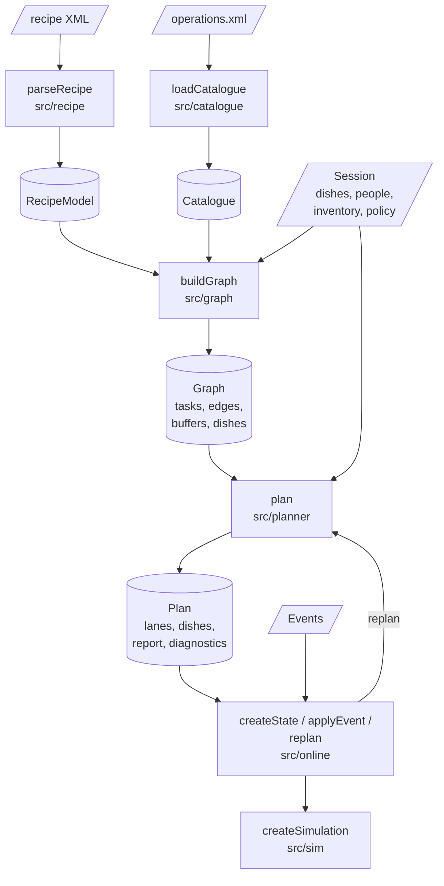
```mermaid
flowchart TB
  rx[/"recipe XML"/] --> parse["parseRecipe<br/>src/recipe"]
  ox[/"operations.xml"/] --> loadCat["loadCatalogue<br/>src/catalogue"]
  parse --> rm[("RecipeModel")]
  loadCat --> cat[("Catalogue")]
  sess[/"Session<br/>dishes, people,<br/>inventory, policy"/] --> build
  rm --> build["buildGraph<br/>src/graph"]
  cat --> build
  build --> g[("Graph<br/>tasks, edges,<br/>buffers, dishes")]
  g --> plan["plan<br/>src/planner"]
  sess --> plan
  plan --> p[("Plan<br/>lanes, dishes,<br/>report, diagnostics")]
  p --> state["createState / applyEvent /<br/>replan<br/>src/online"]
  ev[/"Events"/] --> state
  state -- "replan" --> plan
  state --> sim["createSimulation<br/>src/sim"]
```

`planSession({ recipes, operationsXml, session, DOMParser })` in `src/index.js` runs the first four steps in one call.

### D5. Module map

Which folder imports which. `src/index.js` re-exports every folder and adds `planSession`.

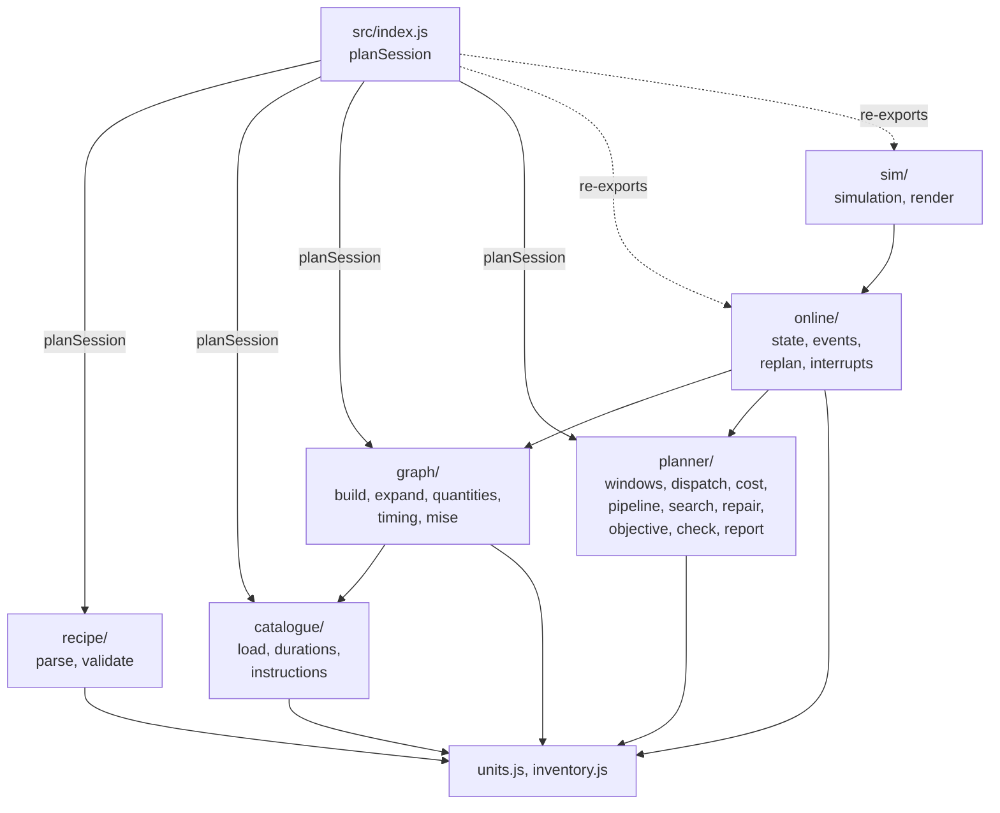
```mermaid
flowchart TB
  index["src/index.js<br/>planSession"]
  recipe["recipe/<br/>parse, validate"]
  catalogue["catalogue/<br/>load, durations,<br/>instructions"]
  gr["graph/<br/>build, expand, quantities,<br/>timing, mise"]
  planner["planner/<br/>windows, dispatch, cost,<br/>pipeline, search, repair,<br/>objective, check, report"]
  online["online/<br/>state, events,<br/>replan, interrupts"]
  sim["sim/<br/>simulation, render"]
  base["units.js, inventory.js"]
  index -- "planSession" --> recipe & catalogue & gr & planner
  index -. "re-exports" .-> online & sim
  gr --> catalogue & base
  recipe & catalogue & planner --> base
  online --> gr & planner & base
  sim --> online
```

### D6. Plan output

What the server broadcasts and the client renders. Times are epoch milliseconds.

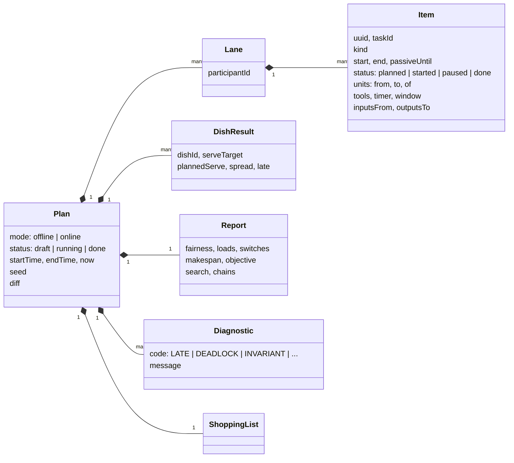
```mermaid
classDiagram
  direction LR
  class Plan {
    mode: offline | online
    status: draft | running | done
    startTime, endTime, now
    seed
    diff
  }
  class Lane {
    participantId
  }
  class Item {
    uuid, taskId
    kind
    start, end, passiveUntil
    status: planned | started | paused | done
    units: from, to, of
    tools, timer, window
    inputsFrom, outputsTo
  }
  class DishResult {
    dishId, serveTarget
    plannedServe, spread, late
  }
  class Report {
    fairness, loads, switches
    makespan, objective
    search, chains
  }
  class Diagnostic {
    code: LATE | DEADLOCK | INVARIANT | ...
    message
  }
  Plan "1" *-- "many" Lane
  Lane "1" *-- "many" Item
  Plan "1" *-- "many" DishResult
  Plan "1" *-- "1" Report
  Plan "1" *-- "many" Diagnostic
  Plan "1" *-- "1" ShoppingList
```

Item kinds: `work`, `resume` (the rest of a split or paused task), `appointment` (a timed finish such as taking the
buns out), `check` (looking in on a monitored task), `cleaning`, `setup`, `blocked` (waiting for a tool) and `idle`.

---

## L3 Graph (Phases A and B)

### D7. Building the graph

`buildGraph` turns every dish into task instances and joins them into one graph for the whole session.

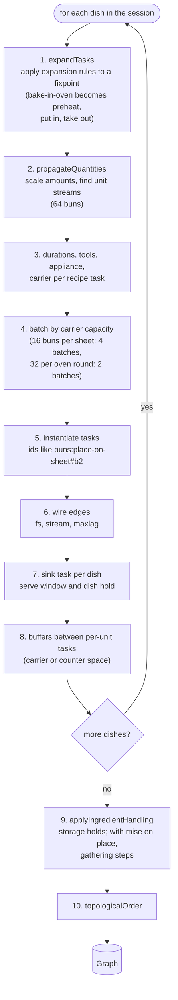
```mermaid
flowchart TB
  start(["for each dish in the session"]) --> exp
  exp["1. expandTasks<br/>apply expansion rules to a fixpoint<br/>(bake-in-oven becomes preheat,<br/>put in, take out)"] --> qty
  qty["2. propagateQuantities<br/>scale amounts, find unit streams<br/>(64 buns)"] --> dur
  dur["3. durations, tools, appliance,<br/>carrier per recipe task"] --> batch
  batch["4. batch by carrier capacity<br/>(16 buns per sheet: 4 batches,<br/>32 per oven round: 2 batches)"] --> inst
  inst["5. instantiate tasks<br/>ids like buns:place-on-sheet#b2"] --> edges
  edges["6. wire edges<br/>fs, stream, maxlag"] --> sink
  sink["7. sink task per dish<br/>serve window and dish hold"] --> buf
  buf["8. buffers between per-unit tasks<br/>(carrier or counter space)"] --> next{"more dishes?"}
  next -- yes --> start
  next -- no --> mise
  mise["9. applyIngredientHandling<br/>storage holds; with mise en place,<br/>gathering steps"] --> topo
  topo["10. topologicalOrder"] --> out[("Graph")]
```

### D8. Graph model

The graph is plain data. Times inside it are seconds; serve times are epoch milliseconds.

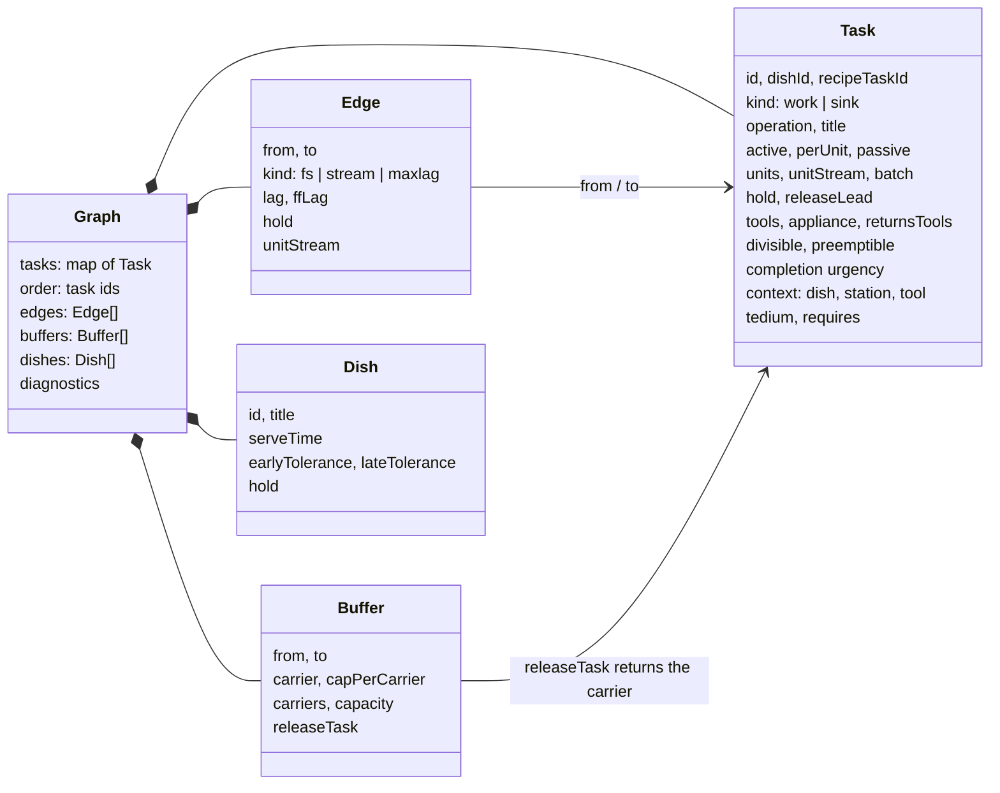
```mermaid
classDiagram
  direction LR
  class Graph {
    tasks: map of Task
    order: task ids
    edges: Edge[]
    buffers: Buffer[]
    dishes: Dish[]
    diagnostics
  }
  class Task {
    id, dishId, recipeTaskId
    kind: work | sink
    operation, title
    active, perUnit, passive
    units, unitStream, batch
    hold, releaseLead
    tools, appliance, returnsTools
    divisible, preemptible
    completion urgency
    context: dish, station, tool
    tedium, requires
  }
  class Edge {
    from, to
    kind: fs | stream | maxlag
    lag, ffLag
    hold
    unitStream
  }
  class Buffer {
    from, to
    carrier, capPerCarrier
    carriers, capacity
    releaseTask
  }
  class Dish {
    id, title
    serveTime
    earlyTolerance, lateTolerance
    hold
  }
  Graph *-- Task
  Graph *-- Edge
  Graph *-- Buffer
  Graph *-- Dish
  Edge --> Task : from / to
  Buffer --> Task : releaseTask returns the carrier
```

### D9. Three kinds of edge

An edge says when the next task may start relative to the one before it.

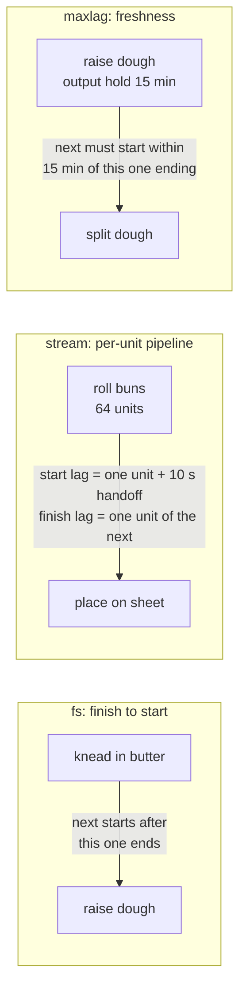
```mermaid
flowchart LR
  subgraph fs["fs: finish to start"]
    a1["knead in butter"] -- "next starts after<br/>this one ends" --> a2["raise dough"]
  end
  subgraph stream["stream: per-unit pipeline"]
    b1["roll buns<br/>64 units"] -- "start lag = one unit + 10 s handoff<br/>finish lag = one unit of the next" --> b2["place on sheet"]
  end
  subgraph maxlag["maxlag: freshness"]
    c1["raise dough<br/>output hold 15 min"] -- "next must start within<br/>15 min of this one ending" --> c2["split dough"]
  end
```

A maxlag edge always comes with an fs or stream edge between the same tasks. The ALAP pass uses the hold to release the
producer late enough (D13).

### D10. Batches and carriers in the buns recipe

Sheets are carriers: the sheet a batch is placed on stays taken until the oven step that lists it among its outputs
gives it back.

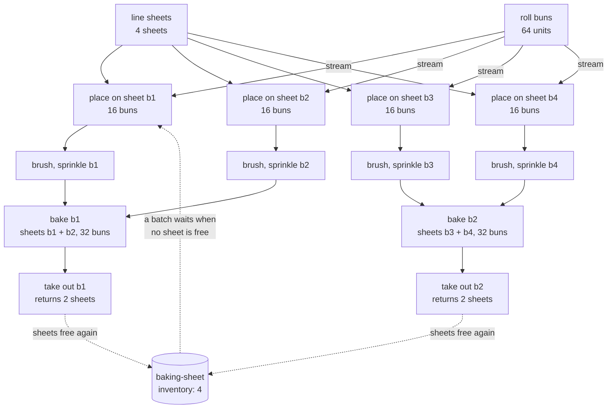
```mermaid
flowchart TB
  line["line sheets<br/>4 sheets"] --> p1 & p2 & p3 & p4
  roll["roll buns<br/>64 units"] -- stream --> p1 & p2 & p3 & p4
  p1["place on sheet b1<br/>16 buns"] --> s1["brush, sprinkle b1"]
  p2["place on sheet b2<br/>16 buns"] --> s2["brush, sprinkle b2"]
  p3["place on sheet b3<br/>16 buns"] --> s3["brush, sprinkle b3"]
  p4["place on sheet b4<br/>16 buns"] --> s4["brush, sprinkle b4"]
  s1 & s2 --> r1["bake b1<br/>sheets b1 + b2, 32 buns"]
  s3 & s4 --> r2["bake b2<br/>sheets b3 + b4, 32 buns"]
  r1 --> o1["take out b1<br/>returns 2 sheets"]
  r2 --> o2["take out b2<br/>returns 2 sheets"]
  o1 & o2 -. "sheets free again" .-> pool[("baking-sheet<br/>inventory: 4")]
  pool -. "a batch waits when<br/>no sheet is free" .-> p1
```

The oven fits two sheets, so the oven step batches by 32. With fewer sheets than batches, placing pauses until a
take-out returns a sheet. Phase D (D18) sizes the workforce so
this blocking is short.

### D11. Ingredient handling and mise en place

What `applyIngredientHandling` adds to the graph. Solid arrows are fs edges, dotted ones are maxlag edges. Without
mise en place only the freshness holds are added.

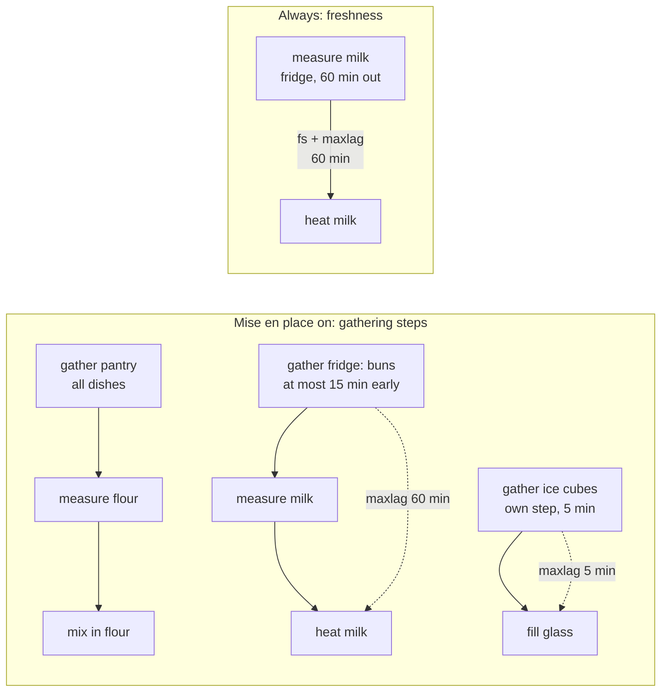
```mermaid
flowchart TB
  subgraph always["Always: freshness"]
    direction TB
    m1["measure milk<br/>fridge, 60 min out"] -- "fs + maxlag<br/>60 min" --> u1["heat milk"]
  end
  subgraph mise["Mise en place on: gathering steps"]
    direction TB
    gp["gather pantry<br/>all dishes"] --> mf["measure flour"] --> mix["mix in flour"]
    gf["gather fridge: buns<br/>at most 15 min early"] --> mm["measure milk"] --> hm["heat milk"]
    gf -. "maxlag 60 min" .-> hm
    gi["gather ice cubes<br/>own step, 5 min"] --> fill["fill glass"]
    gi -. "maxlag 5 min" .-> fill
  end
  always ~~~ mise
```

Items whose out-of-storage time is shorter than the gathering lead (15 min) get a step of their own, right before use.

---

## L3 Planner (Phases C to G)

### D12. One planning run

`plan(graph, session, options)` runs the phases in this order. Each later phase is kept only if it makes the plan
better.

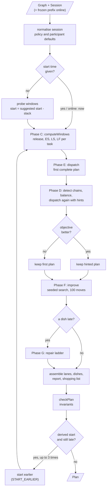
```mermaid
flowchart TB
  in[/"Graph + Session<br/>(+ frozen prefix online)"/] --> norm["normalise session<br/>policy and participant defaults"]
  norm --> t0{"start time<br/>given?"}
  t0 -- "no" --> derive["probe windows<br/>start = suggested start - slack"]
  t0 -- "yes / online: now" --> C
  derive --> C
  C["Phase C: computeWindows<br/>release, ES, LS, LF per task"] --> E
  E["Phase E: dispatch<br/>first complete plan"] --> D
  D["Phase D: detect chains, balance,<br/>dispatch again with hints"] --> keepD{"objective<br/>better?"}
  keepD -- "yes" --> useD["keep hinted plan"]
  keepD -- "no" --> keepE["keep first plan"]
  useD & keepE --> F["Phase F: improve<br/>seeded search, 100 moves"]
  F --> late{"a dish late?"}
  late -- "yes" --> G["Phase G: repair ladder"]
  late -- "no" --> asm
  G --> asm["assemble lanes, dishes,<br/>report, shopping list"]
  asm --> check["checkPlan<br/>invariants"]
  check --> retry{"derived start<br/>and still late?"}
  retry -- "yes, up to 3 times" --> earlier["start earlier<br/>(START_EARLIER)"] --> C
  retry -- "no" --> out[/"Plan"/]
```

### D13. Phase C: time windows

The windows give each task the latest time it can start without making a dish late, and the earliest time it is
allowed to start.

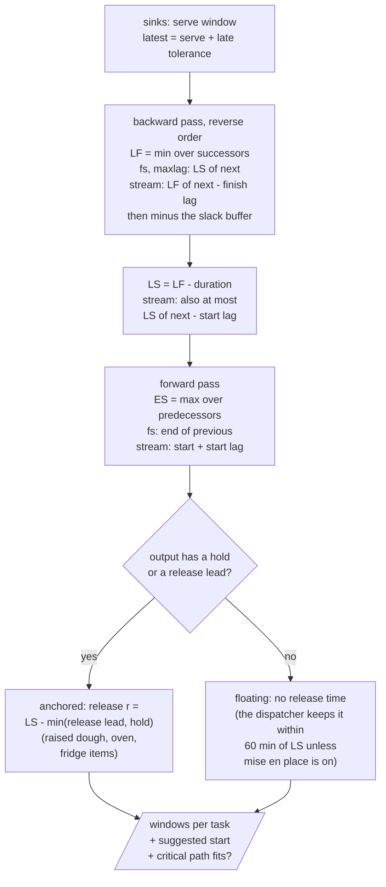
```mermaid
flowchart TB
  sinks["sinks: serve window<br/>latest = serve + late tolerance"] --> back
  back["backward pass, reverse order<br/>LF = min over successors<br/>fs, maxlag: LS of next<br/>stream: LF of next - finish lag<br/>then minus the slack buffer"] --> ls
  ls["LS = LF - duration<br/>stream: also at most<br/>LS of next - start lag"] --> fwd
  fwd["forward pass<br/>ES = max over predecessors<br/>fs: end of previous<br/>stream: start + start lag"] --> rel
  rel{"output has a hold<br/>or a release lead?"}
  rel -- "yes" --> anchored["anchored: release r =<br/>LS - min(release lead, hold)<br/>(raised dough, oven,<br/>fridge items)"]
  rel -- "no" --> floating["floating: no release time<br/>(the dispatcher keeps it within<br/>60 min of LS unless<br/>mise en place is on)"]
  anchored & floating --> out[/"windows per task<br/>+ suggested start<br/>+ critical path fits?"/]
```

### D14. Phase E: the time loop

`dispatch` is list scheduling over time: at each moment it places what is ready, then jumps to the next moment
something changes.

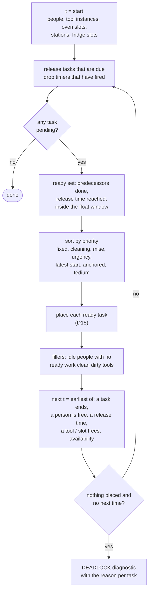
```mermaid
flowchart TB
  init["t = start<br/>people, tool instances, oven slots,<br/>stations, fridge slots"] --> rel
  rel["release tasks that are due<br/>drop timers that have fired"] --> pend{"any task<br/>pending?"}
  pend -- "no" --> done(["done"])
  pend -- "yes" --> ready
  ready["ready set: predecessors done,<br/>release time reached,<br/>inside the float window"] --> sort
  sort["sort by priority<br/>fixed, cleaning, mise, urgency,<br/>latest start, anchored, tedium"] --> each
  each["place each ready task<br/>(D15)"] --> fill
  fill["fillers: idle people with no<br/>ready work clean dirty tools"] --> nextT
  nextT["next t = earliest of: a task ends,<br/>a person is free, a release time,<br/>a tool / slot frees, availability"] --> stuck{"nothing placed and<br/>no next time?"}
  stuck -- "yes" --> dead["DEADLOCK diagnostic<br/>with the reason per task"]
  stuck -- "no" --> rel
```

### D15. Phase E: placing one ready task

The checks run in this order. A failed check makes the task wait and adds the time it can retry.

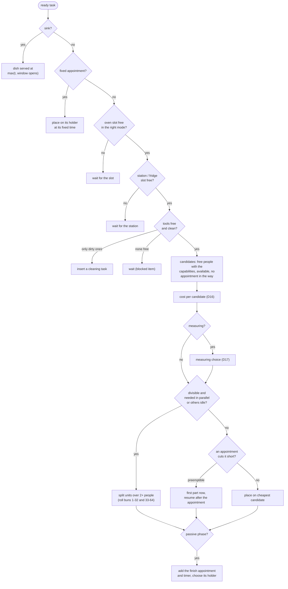
```mermaid
flowchart TB
  r(["ready task"]) --> sink{"sink?"}
  sink -- "yes" --> serve["dish served at<br/>max(t, window opens)"]
  sink -- "no" --> fixed{"fixed appointment?"}
  fixed -- "yes" --> fixedP["place on its holder<br/>at its fixed time"]
  fixed -- "no" --> app{"oven slot free<br/>in the right mode?"}
  app -- "no" --> wait1["wait for the slot"]
  app -- "yes" --> st{"station / fridge<br/>slot free?"}
  st -- "no" --> wait2["wait for the station"]
  st -- "yes" --> tools{"tools free<br/>and clean?"}
  tools -- "only dirty ones" --> clean["insert a cleaning task"]
  tools -- "none free" --> wait3["wait (blocked item)"]
  tools -- "yes" --> cands["candidates: free people with the<br/>capabilities, available, no<br/>appointment in the way"]
  cands --> cost["cost per candidate (D16)"]
  cost --> meas{"measuring?"}
  meas -- "yes" --> mc["measuring choice (D17)"]
  meas -- "no" --> chunk
  mc --> chunk{"divisible and<br/>needed in parallel<br/>or others idle?"}
  chunk -- "yes" --> split["split units over 2+ people<br/>(roll buns 1-32 and 33-64)"]
  chunk -- "no" --> pre{"an appointment<br/>cuts it short?"}
  pre -- "preemptible" --> seg["first part now,<br/>resume after the appointment"]
  pre -- "no" --> place["place on cheapest candidate"]
  split & seg & place --> passive{"passive phase?"}
  passive -- "yes" --> appt["add the finish appointment<br/>and timer, choose its holder"]
```

### D16. Assignment cost

Lower is better. The cheapest free candidate gets the task.

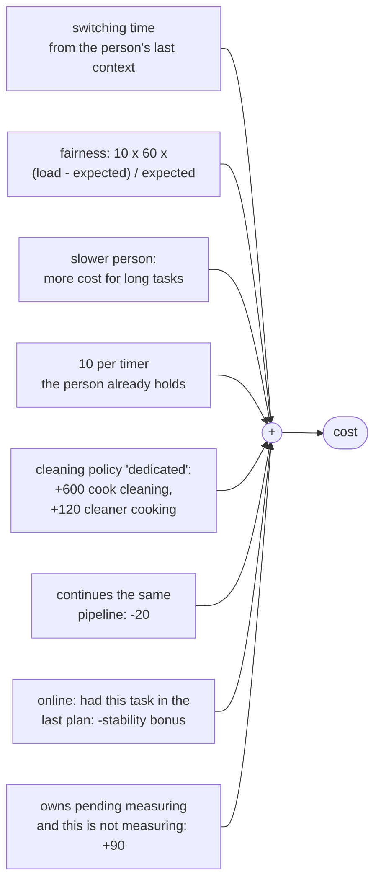
```mermaid
flowchart LR
  setup["switching time<br/>from the person's last context"] --> sum(("+"))
  fair["fairness: 10 x 60 x<br/>(load - expected) / expected"] --> sum
  speed["slower person:<br/>more cost for long tasks"] --> sum
  timers["10 per timer<br/>the person already holds"] --> sum
  role["cleaning policy 'dedicated':<br/>+600 cook cleaning,<br/>+120 cleaner cooking"] --> sum
  chain["continues the same<br/>pipeline: -20"] --> sum
  stable["online: had this task in the<br/>last plan: -stability bonus"] --> sum
  focus["owns pending measuring<br/>and this is not measuring: +90"] --> sum
  sum --> cost(["cost"])
```

Switching time (policy `switchMatrix`, seconds): same task 0; measuring after measuring for any dish 10; same dish,
station and tool 10; otherwise 10 plus 15 (same dish, same station), 30 (same dish, other station) or 60 (other dish),
plus 30 right after cleaning.

### D17. Who measures

One person measures, for every dish. Someone else takes a dish over only when they would otherwise stand idle, when
the measurer is over their fair share, or when waiting for the measurer would take too long.

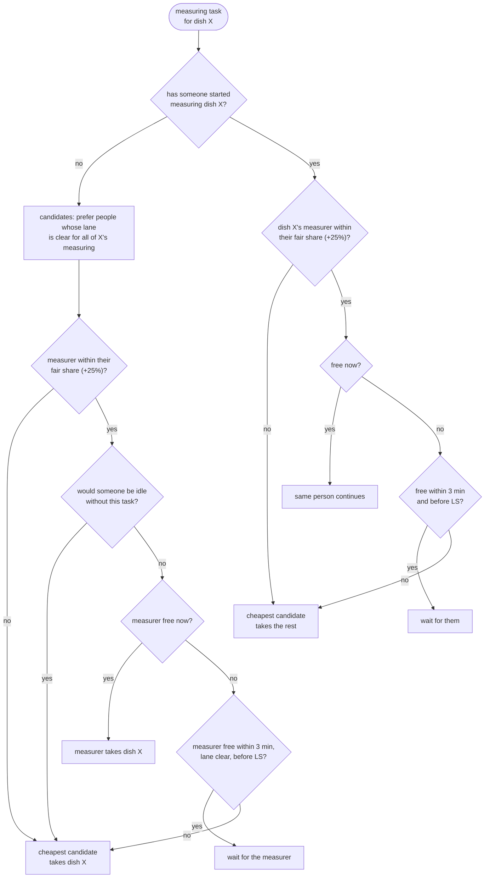
```mermaid
flowchart TB
  t(["measuring task<br/>for dish X"]) --> started{"has someone started<br/>measuring dish X?"}
  started -- "no" --> pool["candidates: prefer people whose lane<br/>is clear for all of X's measuring"]
  pool --> share1{"measurer within their<br/>fair share (+25%)?"}
  share1 -- "no" --> any1["cheapest candidate<br/>takes dish X"]
  share1 -- "yes" --> idle{"would someone be idle<br/>without this task?"}
  idle -- "yes" --> any1
  idle -- "no" --> free1{"measurer free now?"}
  free1 -- "yes" --> m1["measurer takes dish X"]
  free1 -- "no" --> wait1{"measurer free within 3 min,<br/>lane clear, before LS?"}
  wait1 -- "yes" --> w1["wait for the measurer"]
  wait1 -- "no" --> any1
  started -- "yes" --> share2{"dish X's measurer within<br/>their fair share (+25%)?"}
  share2 -- "no" --> any2["cheapest candidate<br/>takes the rest"]
  share2 -- "yes" --> free2{"free now?"}
  free2 -- "yes" --> m2["same person continues"]
  free2 -- "no" --> wait2{"free within 3 min<br/>and before LS?"}
  wait2 -- "yes" --> w2["wait for them"]
  wait2 -- "no" --> any2
```

The fair share is measured against the whole session's work, not the work handed out so far, because measuring comes
first and the measurer would otherwise always look ahead.

### D18. Phase D: pipeline balancing

For per-unit chains (roll, place, brush, sprinkle) Phase D works out how many people each stage needs, so the line
neither starves nor fills every carrier.

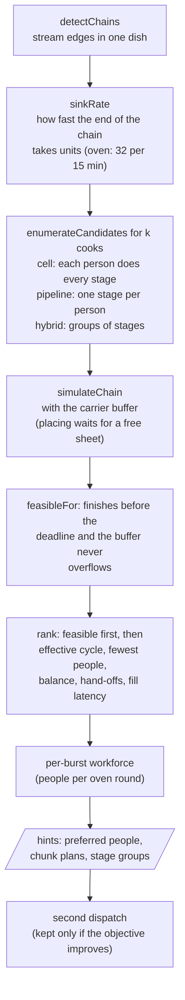
```mermaid
flowchart TB
  dc["detectChains<br/>stream edges in one dish"] --> sr
  sr["sinkRate<br/>how fast the end of the chain<br/>takes units (oven: 32 per 15 min)"] --> cand
  cand["enumerateCandidates for k cooks<br/>cell: each person does every stage<br/>pipeline: one stage per person<br/>hybrid: groups of stages"] --> simc
  simc["simulateChain<br/>with the carrier buffer<br/>(placing waits for a free sheet)"] --> feas
  feas["feasibleFor: finishes before the<br/>deadline and the buffer never<br/>overflows"] --> rank
  rank["rank: feasible first, then<br/>effective cycle, fewest people,<br/>balance, hand-offs, fill latency"] --> burst
  burst["per-burst workforce<br/>(people per oven round)"] --> hints
  hints[/"hints: preferred people,<br/>chunk plans, stage groups"/] --> dispatch2["second dispatch<br/>(kept only if the objective improves)"]
```

### D19. Phase F: improvement search

Seeded simulated annealing over the dispatcher's hooks. The same seed gives the same plan, because 100 moves end the
search before the wall-clock safety cap.

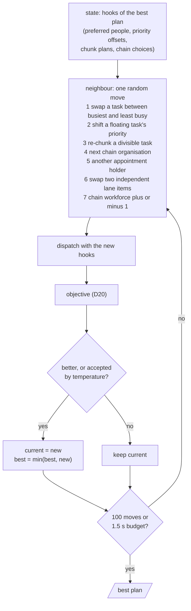
```mermaid
flowchart TB
  s0["state: hooks of the best plan<br/>(preferred people, priority offsets,<br/>chunk plans, chain choices)"] --> mv
  mv["neighbour: one random move<br/>1 swap a task between busiest and least busy<br/>2 shift a floating task's priority<br/>3 re-chunk a divisible task<br/>4 next chain organisation<br/>5 another appointment holder<br/>6 swap two independent lane items<br/>7 chain workforce plus or minus 1"] --> disp
  disp["dispatch with the new hooks"] --> obj["objective (D20)"]
  obj --> acc{"better, or accepted<br/>by temperature?"}
  acc -- "yes" --> cur["current = new<br/>best = min(best, new)"]
  acc -- "no" --> keep["keep current"]
  cur & keep --> stop{"100 moves or<br/>1.5 s budget?"}
  stop -- "no" --> mv
  stop -- "yes" --> best[/"best plan"/]
```

### D20. Objective

One number to compare plans. Weights come from the policy; fairness and idle time weigh more than makespan.

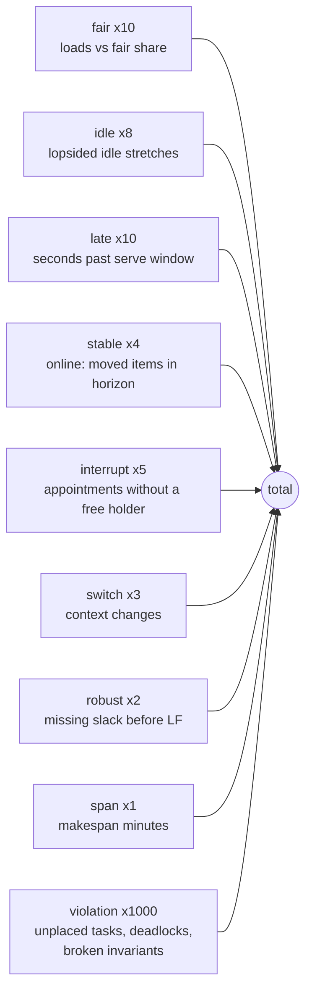
```mermaid
flowchart LR
  fair["fair x10<br/>loads vs fair share"] --> total(("total"))
  idle["idle x8<br/>lopsided idle stretches"] --> total
  late["late x10<br/>seconds past serve window"] --> total
  stable["stable x4<br/>online: moved items in horizon"] --> total
  interrupt["interrupt x5<br/>appointments without a free holder"] --> total
  sw["switch x3<br/>context changes"] --> total
  robust["robust x2<br/>missing slack before LF"] --> total
  span["span x1<br/>makespan minutes"] --> total
  viol["violation x1000<br/>unplaced tasks, deadlocks,<br/>broken invariants"] --> total
```

### D21. Phase G: repair ladder

Only runs when a dish is late. The first four rungs change the plan and run in order until nothing is late; the last
three only report or propose.

```mermaid
flowchart TB
  in(["a dish is late"]) --> r1
  r1["REPAIR_FLOAT<br/>let floating preparation<br/>start earlier"] --> q1{"late?"}
  q1 -- "yes" --> r2["REPAIR_SLACK<br/>drop the slack buffer<br/>before deadlines"]
  r2 --> q2{"late?"}
  q2 -- "yes" --> r3["REPAIR_CHUNK<br/>chunks below the minimum run,<br/>chains fully staffed"]
  r3 --> q3{"late?"}
  q3 -- "yes" --> r4["REPAIR_HOLDING<br/>a holding resource (warm oven,<br/>fridge) extends the dish hold"]
  r4 --> q4{"late?"}
  q1 & q2 & q3 & q4 -- "no" --> spread
  q4 -- "yes" --> spread["REPAIR_SPREAD (report)<br/>portions finishing<br/>too far apart"]
  spread --> q5{"still late?"}
  q5 -- "yes" --> sugg["REPAIR_DELAY (proposal)<br/>a later serve time<br/>REPAIR_START (proposal)<br/>an earlier start or more people"]
  q5 -- "no" --> out(["repaired plan"])
  sugg --> out
```

When nobody fixed the start time, `plan()` does not only suggest it: it moves the start earlier and plans again (D12).

---

## L3 Resources

### D22. A tool instance

Each physical tool (bowl #1, sheet #3) has its own state. Dirty tools are cleaned when a task needs one, or by an idle
person at the end.

```mermaid
stateDiagram-v2
  [*] --> Clean
  Clean --> InUse: a task binds it
  InUse --> InUse: reserved, held until the output<br/>it carries is consumed
  InUse --> Clean: released, soil none
  InUse --> Dirty: released, soil rinse or wash
  Dirty --> CleaningPlanned: a task needs this type and<br/>no clean one is free, or an idle filler
  CleaningPlanned --> Clean: rinse or wash time passes
  Clean --> [*]
```

A carrier (a baking sheet) is bound per batch key, so one batch's sheet is never taken by another batch until the task
that lists the sheet among its outputs returns it.

### D23. The oven

An appliance has slots and a mode. The mode can only change when every slot is empty.

```mermaid
stateDiagram-v2
  [*] --> Cold
  Cold --> Preheating: preheat at 225 C<br/>(sets the mode)
  Preheating --> Hot: preheat time passes
  Hot --> Baking: put in (takes slots)
  Baking --> Hot: take out (frees slots)
  Baking --> Baking: another round in a free slot<br/>at the same temperature
  Hot --> Preheating: other temperature needed,<br/>only when all slots are empty
  Hot --> [*]
```

The preheat output holds 20 minutes, so the preheat is anchored just before the first bake instead of at the start.

### D24. Passive tasks, timers and appointments

Whoever starts a passive task does not have to finish it. The finish is an appointment held by a person whose lane is
free at that time.

```mermaid
sequenceDiagram
  autonumber
  participant Bea
  participant Planner
  participant Oven
  participant Cal
  Planner->>Bea: put buns into the oven at 17:20
  Bea->>Oven: put in round (2 sheets)
  Note over Oven: passive bake, 15 min
  Planner->>Planner: pick the holder: free at 17:36,<br/>fewest timers, fair
  Planner->>Bea: timer 17:36 and appointment<br/>"take buns out" (critical)
  Note over Bea,Cal: Bea's lane is blocked around 17:36,<br/>other work is planned around it
  Oven-->>Bea: timer fires
  Bea->>Oven: take out, sheets returned
  Planner->>Cal: transfer the buns to the rack
```

---

## L3 Online mode

### D25. Session lifecycle

Before the start the plan is a draft that is redone on every change. After the start it is updated as events come in.

```mermaid
stateDiagram-v2
  [*] --> Draft: POST /api/sessions
  Draft --> Draft: settings change,<br/>offline plan
  Draft --> Running: startSession<br/>(placeholders reconciled,<br/>first online plan)
  Running --> Running: events,<br/>replan with frozen prefix
  Running --> Done: every item done
  Running --> Draft: restart<br/>(events cleared)
  Done --> [*]
```

### D26. A plan item

```mermaid
stateDiagram-v2
  [*] --> Planned
  Planned --> Planned: replan moves it<br/>(another person or time)
  Planned --> Started: taskStarted
  Started --> Done: taskDone
  Started --> Paused: taskPaused,<br/>or an interrupt
  Paused --> Started: resume item started<br/>(same uuid, remaining units)
  Done --> [*]
```

Done and started items are frozen: a replan never moves them.

### D27. Draft planning

Any setting the host changes produces a new offline plan for everyone.

```mermaid
sequenceDiagram
  autonumber
  actor Host
  participant Srv as Server
  participant Plan as planning.js
  participant Sch as scheduler
  participant Apps as All apps
  Host->>Srv: updateDishes, updateInventory<br/>or updatePolicy
  Srv->>Srv: save to SQLite
  Srv->>Plan: rebuild(sessionId)
  Plan->>Plan: buildSession from the DB
  Plan->>Sch: planSession(recipes,<br/>operations, session)
  Sch-->>Plan: offline Plan (draft)
  Plan->>Plan: persist plan_json
  Plan-->>Srv: onPlan(plan)
  Srv-->>Apps: session, plan
```

### D28. Starting the session

```mermaid
sequenceDiagram
  autonumber
  actor Host
  participant IO as Socket.IO
  participant Plan as planning.js
  participant St as online state
  participant Apps as All apps
  Host->>IO: startSession
  IO->>Plan: start(sessionId, now)
  Plan->>St: createState(session, catalogue)
  Plan->>St: applyEvent(sessionStarted)
  Note over St: placeholder lanes nobody took over<br/>are removed (people who joined earlier<br/>already took over the closest one)
  Plan->>St: replan(state, now)
  St-->>Plan: online Plan (running)
  Plan-->>IO: plan
  IO-->>Apps: session (running), plan
```

### D29. A task starts or finishes

Small deviations only update the item. A deviation over 90 s, a different person, or a pause triggers a replan.

```mermaid
sequenceDiagram
  autonumber
  actor Ada
  participant IO as Socket.IO
  participant Plan as planning.js
  participant St as online state
  participant Apps as All apps
  Ada->>IO: event taskDone (uuid)
  IO->>Plan: applyEvent(sessionId, event)
  Plan->>St: applyEvent(state, event)
  St-->>Plan: state, replanNeeded, reason
  alt replan needed
    Plan->>Plan: replan now, or after the rest of<br/>the 10 s debounce if one just ran
    Plan->>St: replan(state, now)
    St-->>Plan: plan + diff per person
    Plan-->>IO: plan with diff
  else on time
    Plan-->>IO: plan (item marked done)
  end
  IO-->>Apps: plan
  Plan->>Plan: checkInterrupts(now)
```

### D30. Which events replan

```mermaid
flowchart LR
  subgraph task["Task events"]
    ts["taskStarted"]
    td["taskDone"]
    tp["taskProgress"]
    tpa["taskPaused"]
  end
  subgraph appt["Appointments and timers"]
    aa["appointmentAcknowledged"]
    tf["timerFired"]
  end
  subgraph roster["Roster and resources"]
    pj["participantJoined / Left / Paused"]
    dc["deadlineChanged"]
    rc["resourceChanged"]
    ss["sessionStarted"]
  end
  ts & td --> dev{"other person, or more<br/>than 90 s off plan?"}
  tp --> dev
  dev -- "yes" --> rp(["replan"])
  dev -- "no" --> upd(["update the item only"])
  tpa --> rp
  aa --> who{"acknowledged by<br/>someone else?"}
  who -- "yes" --> rp
  who -- "no" --> upd
  tf --> upd
  pj & dc & rc & ss --> rp
```

A person who joins and takes over a placeholder lane with the same profile does not trigger a replan.

### D31. Inside a replan

```mermaid
flowchart TB
  prev[/"previous plan + events"/] --> fz
  fz["frozenFromPlan<br/>done: actual start and end<br/>running: remaining active time<br/>paused: remaining units"] --> pref
  pref["preferAssignments<br/>who had each item within<br/>the next 15 min"] --> pl
  pl["plan(graph, session, mode online,<br/>now, frozen, preferAssignments)<br/>30 search moves"] --> res
  res["paused tasks come back as<br/>resume items with their old uuid"] --> carry
  carry["carry the frozen items<br/>into their lanes"] --> chk
  chk["checkPlan on the whole plan<br/>(tools of done items not rechecked)"] --> diff
  diff["diffPlans: changes per person<br/>within the horizon, with the reason"] --> out[/"new plan + diff"/]
```

### D32. Interrupt and escalation

When the holder of an appointment is not free in time, the server picks the cheapest person to interrupt and moves on
if they do not acknowledge.

```mermaid
sequenceDiagram
  autonumber
  participant Plan as planning.js
  participant Cal
  participant Dee
  participant St as online state
  Plan->>Plan: checkInterrupts: take-out opens at<br/>firesAt - lead 30 s - reaction 30 s
  Plan->>Plan: holder busy with a non-preemptible task
  Plan->>St: chooseInterruptTarget: cheapest of<br/>switch time + preemption cost + 10 per live timer
  St-->>Plan: Cal, preempts 'roll buns'
  Plan->>Cal: interrupt (title, instructions, deadline)
  Note over Cal: no acknowledgement within 15 s
  Plan->>St: nextInterruptTarget, excluding Cal
  St-->>Plan: Dee
  Plan->>Dee: interrupt
  Dee->>Plan: appointmentAcknowledged
  Plan->>St: applyEvent: taken over by Dee
  St-->>Plan: replanNeeded
  Plan->>Plan: replan, broadcast
```

### D33. Simulation

The demo replays a session with simulated people: each tick finishes, interrupts and starts work, and every event goes
through the real online code.

```mermaid
sequenceDiagram
  autonumber
  participant Sim as createSimulation
  participant St as online state
  participant People as simulated cooks
  Sim->>St: createState, sessionStarted, replan
  loop every 5 s of simulated time
    Sim->>People: finish items whose time is up
    People->>St: taskDone
    Sim->>St: dueInterrupts(now)
    St-->>People: pause current work, take the appointment
    Sim->>People: start the next item when its inputs are done
    Note over People: duration noise 25%,<br/>10% start late
    People->>St: taskStarted
    St-->>Sim: replanNeeded, replan, diff
  end
  Sim->>Sim: metrics: lateness, fairness,<br/>replans, interrupts
```

---

## L4 Examples

These come from real runs of `planSession` on the recipes in `packages/server/src/recipes` (serve 18:00 UTC, seed 1).

### D34. The buns recipe as a task graph

Recipe tasks and their outputs, with holds. The shaping chain (orange) is a per-unit pipeline.

```mermaid
flowchart TB
  meas["measure milk, yeast, sugar,<br/>cardamom, eggs, flour, butter"] --> heat["heat milk<br/>warm milk: hold 10 min"]
  heat --> dis["dissolve yeast"]
  dis --> wet["mix wet ingredients"]
  wet --> flour["mix in flour"]
  flour --> butter["knead in butter"]
  butter --> raise["raise dough, 20 min<br/>raised dough: hold 15 min"]
  raise --> split["split dough<br/>64 pieces"]
  egg["measure egg, beat egg<br/>beaten egg: hold 60 min"] --> brush
  line["line 4 sheets"] --> place
  split --> roll["roll buns"]
  roll --> place["place on sheet<br/>16 per sheet"]
  place --> brush["brush"]
  brush --> spr["sprinkle pearl sugar<br/>oven ready: hold 30 min"]
  pre["preheat oven<br/>hot oven: hold 20 min"] --> bake
  spr --> bake["bake, 15 min per round<br/>baked bun: hold 10 min"]
  bake --> rack["transfer to rack"]
  rack --> serve(["serve"])
  classDef chain fill:#f6d7b0,stroke:#b5651d,color:#3b2412
  class roll,place,brush,spr chain
```

### D35. Buns for three cooks: the shaping pipeline

From the real plan for buns with Ada, Bea and Cal. Rolling is split in two, the sheets move through placing,
brushing and sprinkling, and the two oven batches follow each other. Sheets b3 and b4 were ready first, so bake b2
goes in first.

```mermaid
gantt
  title Buns, 3 cooks (excerpt 17:04 to 17:56)
  dateFormat HH:mm
  axisFormat %H:%M
  section Ada
  roll buns 1-32       :a1, 17:06, 8m
  brush b3             :a2, 17:14, 1m
  brush b4             :a3, 17:16, 1m
  brush b1             :a4, 17:17, 1m
  brush b2             :a5, 17:19, 1m
  section Bea
  take raised dough    :crit, b0, 17:04, 1m
  roll buns 33-64      :b1, 17:07, 8m
  place b4             :b2, 17:15, 1m
  place b1             :b3, 17:17, 1m
  place b2             :b4, 17:18, 1m
  bake b2 in           :b5, 17:20, 1m
  take out b2          :crit, b6, 17:36, 1m
  bake b1 in           :b7, 17:36, 1m
  take out b1          :crit, b8, 17:52, 1m
  section Cal
  split dough          :c1, 17:05, 3m
  place b3             :c2, 17:09, 6m
  sprinkle b3          :c3, 17:15, 1m
  sprinkle b4          :c4, 17:17, 1m
  sprinkle b1          :c5, 17:18, 1m
  sprinkle b2          :c6, 17:20, 1m
  rack b2              :c7, 17:51, 2m
  rack b1              :c8, 17:53, 2m
  section Oven
  bake b2              :o1, 17:21, 15m
  bake b1              :o2, 17:37, 15m
```

### D36. Mise en place: buns and a negroni for two cooks

From the real plan with mise en place on. Ada gathers the pantry items and measures shelf-stable ingredients for both
dishes. Fridge and freezer items come out just before use: milk at 16:31 for the buns, vermouth at 17:40 and ice at
17:51 and 17:59 for the negroni served at 18:10.

```mermaid
gantt
  title Buns + negroni, 2 cooks, mise en place on
  dateFormat HH:mm
  axisFormat %H:%M
  section Ada
  gather pantry, both dishes   :a1, 16:22, 2m
  measure sugar, flour, cardamom :a2, 16:24, 3m
  measure bitters, Campari, rum :a3, 16:27, 4m
  gather from fridge (buns)    :crit, a4, 16:31, 1m
  measure milk, yeast, eggs, butter :a5, 16:32, 6m
  roll buns                    :a6, 17:05, 16m
  stir and strain negroni      :a7, 17:59, 2m
  section Bea
  line sheets                  :b1, 16:22, 4m
  peel orange                  :b2, 16:27, 2m
  heat milk to knead in butter :b3, 16:35, 8m
  split dough, place on sheets :b4, 17:04, 24m
  gather from fridge (negroni) :crit, b5, 17:40, 1m
  measure vermouth             :b6, 17:41, 1m
  gather ice cubes             :crit, b7, 17:51, 1m
  fill glass, build drink      :b8, 17:52, 2m
  gather large ice cube        :crit, b9, 17:59, 1m
  garnish                      :b10, 18:06, 3m
```

Without mise en place there are no gathering steps; measuring still goes to one person per dish and perishable
ingredients still carry their out-of-storage holds (D11).
